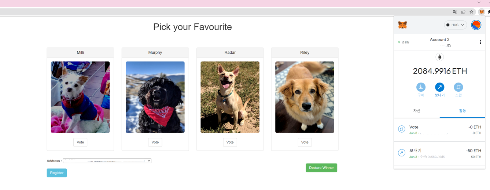
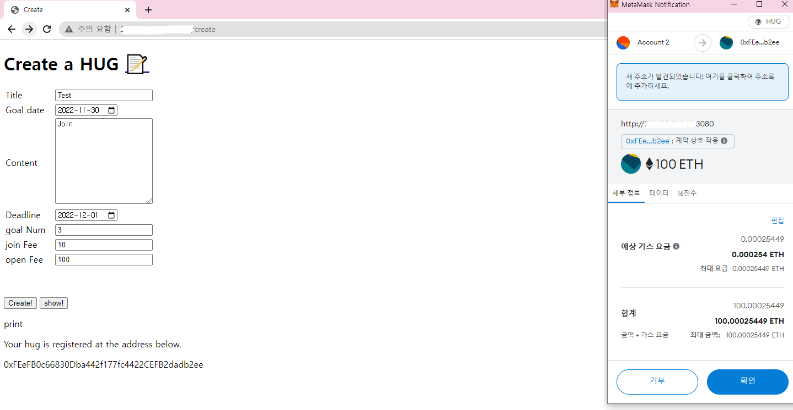
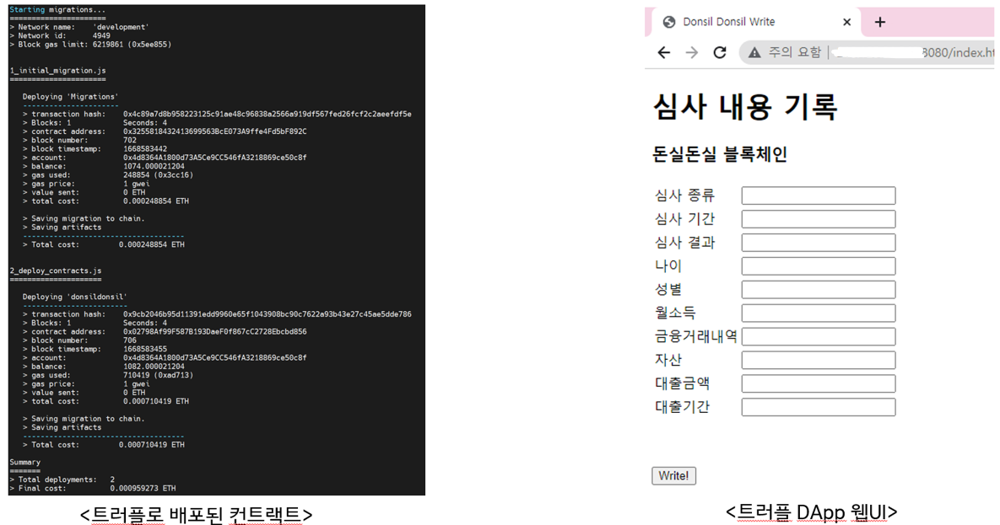

## Dapp
: 댑을 위한 스마트컨트랙트 코드와 프런트엔드 코드

## How to Use
* Main 브랜치는 솔리디티로 작성한 스마트컨트랙트 코드
  ** 참고 : 블록체인 인 액션
            비나 리마머시 저/정우현 역 | 2021년 07월 26일 출간 | 제이펍 | ISBN 1191600122   
* ubuntu 브랜치는 트러플과 프라이빗 이더리움 네트워크 폴더로 구성
  - Ballot Dapp : 블록체인 인 액션의 예제
    </img>
  - HUGDapp : 연구 개발한 디앱으로 이벤트 진행을 도움
    </img>
  - data_testnet : 프라이빗 이더리움 네트워크
  - donsildonsilDapp : 돈실돈실팀의 대구은행 공모전 디앱으로 간단한 금융 심사 정보를 저장할 수 있음
    </img>
  - test : helloworld 디앱 (테스트 및 베이직)

## How to Install
1. 우분투 환경에서 이더리움 노드 설치 필요 (노드 설치를 통한 프라이빗/테스트 네트워크 구현 필요)
<pre>
<code>
docker pull dofl0119/dapp
docker run -i -t -d --name Dapp -p 30303:30303 -p 8545:8545 dofl0119/dapp
</code>
</pre>

2. 트러플 설치
<pre>
<code>
Npm install -g truffle
turffle version
</code>
</pre>

3. 구글 크롬에 메타마스크 플러그인 설치 후 프라이빗 네트워크와 연결   
https://metamask.io/

* * *

> **관련 논문**   
* Aeri Kim, Meryam Essaid, Junheong Ryu, Hongtaek ju, "Hands-up-go : Development of gas efficient Blockchain event DApp", International Conference on Information Networking(ICOIN 2023), Jan. 2023
* 김애리, 주홍택, "이더리움에서 중복 사용 스마트 계약 가스 비용 분석", 통신망운용관리 학술대회(KNOM Conf. 2022), pp. 154-157, May. 2022.
